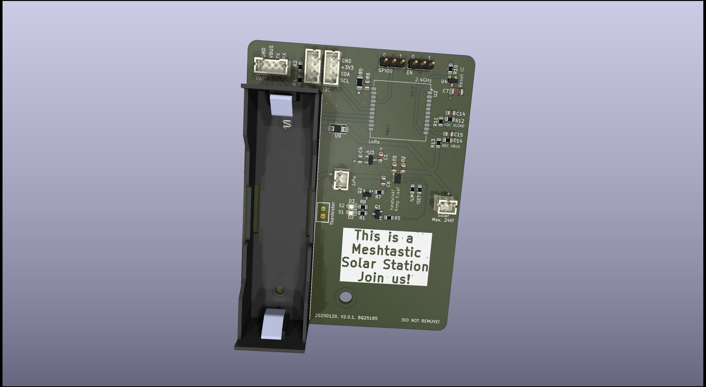
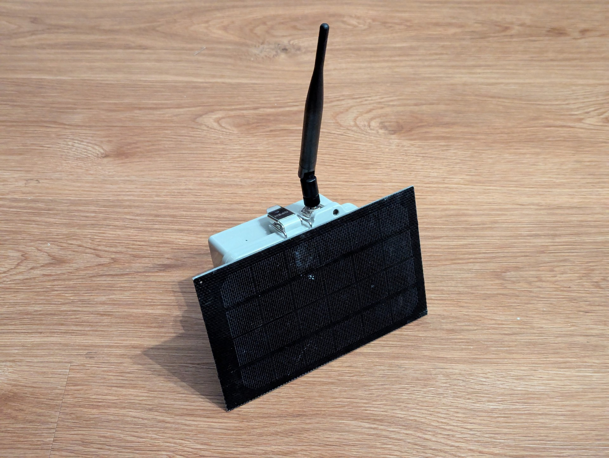

# Evaluation of the v2.0.0 

## Setup

- Antenna: 5dBi omnidirectional, resonant on 868MHz
- Battery: KeePower, 4000mA. 3.7V, PartNo.  P1840C
- Solar: 9V, 400mA, Noname product from Aliexpress
- End of charge voltage: 4.2V
- Meshtastic Git Hash: f18a92e8c5be5a483a47b97adc58886808b12fc5 + Pin modifications 

LEDs S1/S2 and their transistors haven't been placed as I don't need them.

No sensors added.

# Meshtastic Configuration

- Role: CLIENT
- Power Saving: Disabled  (!)
- Telemetry rate: 1h

Other configurations are default.

# Picture of the integrated PCB

# Picture of the entire device

# Power consumption (Grafana)

Todo. Waiting for a few more days.

# Lessons learned

Pretty mutch all construction things from the last tested version (v0.2) still apply and turned out be be very successful. Especially using the solar panel as sun shield with ~4mm plastic spacers keeps the system temperature low - even during the summer time.

Switching the battery type 18650 standard blocks was also a good decision. This reduced costs a lot and increased the overall storage capacatiy dramatically as they have trustable datasheets.

 